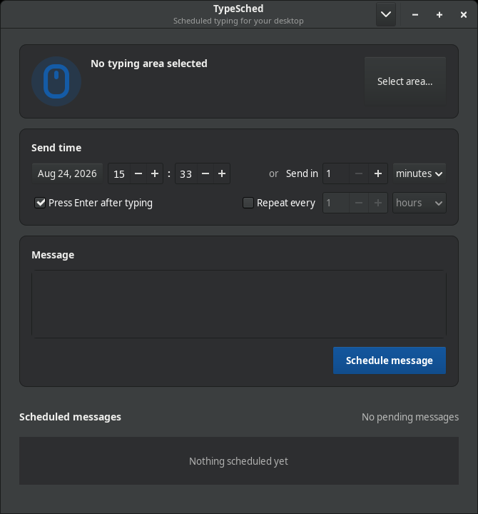
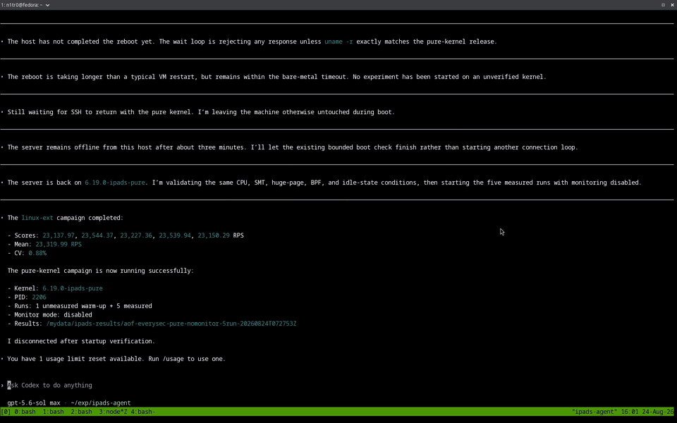

<div align="center">
  
  <h1>TypeSched</h1>
  <p><em>Pick a chat box. Choose a time. Let TypeSched do the typing.</em></p>
</div>

<p align="center">
  <a href="https://github.com/bsuvonov/type-sched/stargazers"></a>
  
  
  
</p>

<p align="center">
  
</p>

TypeSched is a small native GTK utility for scheduling text in another desktop app.
It remembers the window and input area you choose, brings that window forward at the
scheduled time, clicks the right place, types your message, and optionally presses Enter.

It is built for Linux desktops running **X11**, with first-class support for Xfce.

## Features

- **Point-and-drag targeting** — select a chat input with a familiar screenshot-style rectangle.
- **Window-aware delivery** — returns to the selected window and follows it when it moves or resizes.
- **Flexible scheduling** — choose an exact date and minute or use the quick **Send in** control.
- **Recurring messages** — repeat at minute, hour, or day intervals without catch-up bursts.
- **Natural typing** — writes through `xdotool`, supports multiline messages, and can press Enter to send.
- **Persistent queue** — pending work survives app restarts and remains available from the notification area.
- **Safety-minded behavior** — skips stale sends and waits when a supported screen locker reports that the session is locked.
- **Local by design** — no account, cloud service, or chat-app integration is required.

## Usage example

<p align="center">
  <a href="docs/type-sched-demo.mp4?raw=1">
    
  </a>
</p>

<p align="center"><sub>The preview plays automatically. Click it to open the full-quality video with playback controls.</sub></p>

## How it works

| 1. Select | 2. Compose | 3. Schedule | 4. Send |
| --- | --- | --- | --- |
| Draw a rectangle around the destination input box. | Write the text and choose whether Enter should be pressed. | Pick an exact time, a relative delay, and an optional repeat interval. | TypeSched activates the recorded window, clicks the target, types, and sends. |

The click position is stored relative to the selected window. If the window moves or
resizes, TypeSched calculates the corresponding point instead of blindly using the old
screen coordinates.

## Quick start

TypeSched requires Python 3.10 or newer, GTK 3 with PyGObject and Pycairo, and `xdotool`.

**Fedora / Xfce**

```bash
sudo dnf install python3-gobject gtk3 xdotool
git clone https://github.com/bsuvonov/type-sched.git
cd type-sched
./install.sh
```

Then open **TypeSched** from the application menu, or run:

```bash
type-sched
```

The installer copies the app into your user data directory, adds a desktop entry and
icon, and creates `~/.local/bin/type-sched`. It does not require root access.

**Run without installing**

```bash
./type-sched
```

## Schedule a message

1. Open the destination app and leave its message field visible.
2. Click **Select area…**, then drag a rectangle around the input field.
3. Choose the first send time directly or set **Send in** to a number of minutes or hours.
4. Write the message and optionally enable **Repeat every**.
5. Click **Schedule message** and leave TypeSched running.

Closing the main window hides TypeSched in the notification area. Use the tray menu's
**Quit** action when you actually want to stop it; pending messages are not sent while
the app is closed.

## Delivery behavior

- The recorded window is activated before TypeSched clicks or types.
- Multiline text uses `Shift+Enter` between lines and `Enter` at the end.
- Disable **Press Enter after typing** when the destination app uses another send shortcut.
- A one-time message more than five minutes late is marked missed instead of being sent unexpectedly.
- A stale recurring occurrence is skipped, and the task advances to its next future interval.
- A recurring task stays in the queue after each attempt. Cancel its queue entry to stop it.
- Failed attempts are recorded; recurring tasks continue at the following interval.
- Desktop notifications report successful and failed attempts.

## Safety, privacy, and limitations

TypeSched controls the desktop like a person using a mouse and keyboard. Before relying on
it, test with a harmless message and a short delay.

- **X11 only:** automation uses `xdotool`. Wayland input emulation is not supported.
- **Keep the target available:** do not close or replace the selected destination window before delivery.
- **Keep the field stable:** the input box should remain at the same relative place inside its window.
- **Expect focus changes:** sending activates the destination window and moves the pointer to the selected area.
- **Lock-screen detection:** TypeSched checks supported Xfce and freedesktop screen-lock services over D-Bus when available.
- **Plain-text storage:** scheduled messages are saved in `$XDG_CONFIG_HOME/type-sched/jobs.json`—normally `~/.config/type-sched/jobs.json`—with permissions limited to your user.
- **No network service:** TypeSched does not upload messages or connect to chat-provider APIs.

When TypeSched successfully attaches the selection to a window, it refuses a missing
window instead of typing into whichever app happens to be focused. If attachment is not
possible during selection, the app warns you and stores a fixed screen position instead.

## Development

Run the test suite and syntax checks from the repository root:

```bash
python3 -m unittest discover -v
python3 -m py_compile type-sched typesched/*.py tests/*.py
```

The code is split into three small parts:

- `typesched/ui.py` — GTK interface, region selector, tray icon, and scheduler.
- `typesched/automation.py` — bounded, shell-free `xdotool` integration.
- `typesched/model.py` — persisted targets, jobs, and recurrence behavior.

## Support

If TypeSched is useful, consider giving the project a star. Bug reports and focused pull
requests are welcome in [GitHub Issues](https://github.com/bsuvonov/type-sched/issues).
